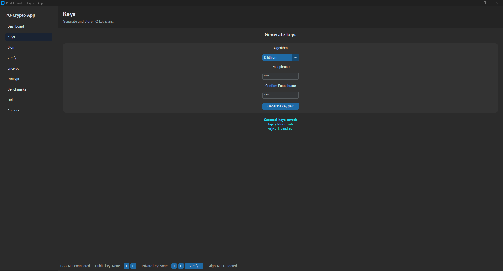
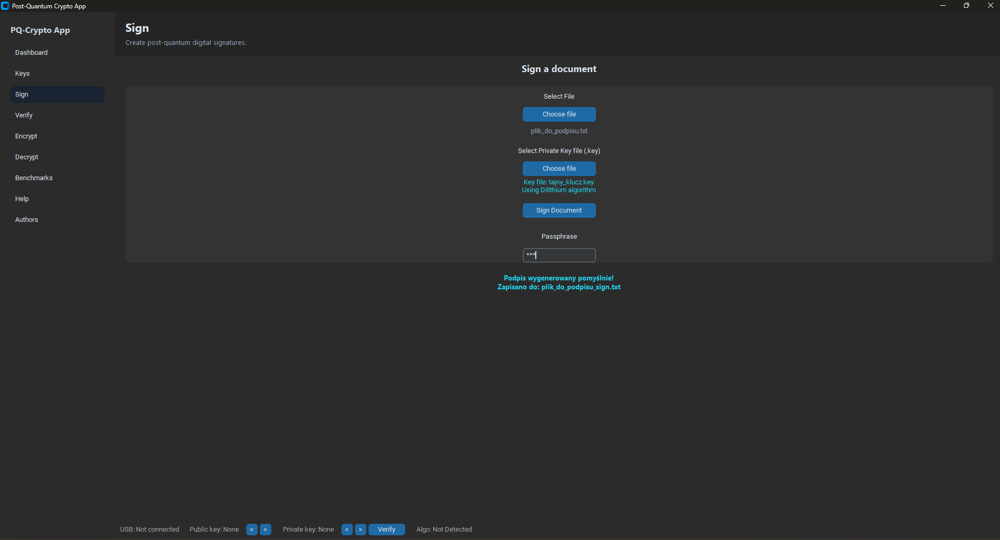
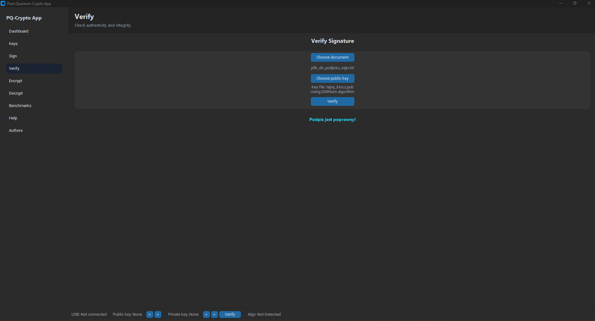
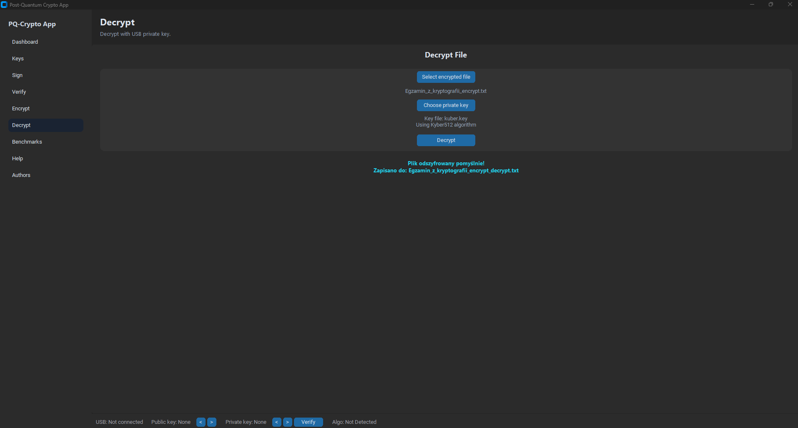
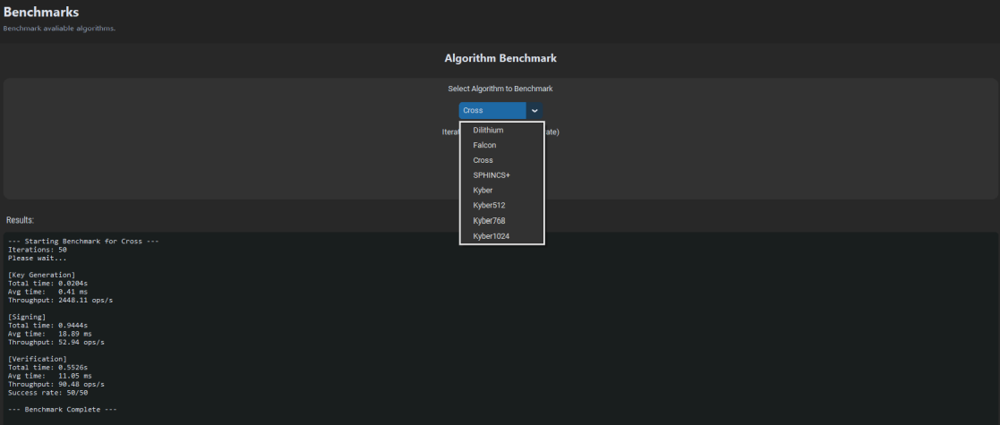

# PQ-Crypto App  
**Post-Quantum Cryptography Desktop Application**

PQ-Crypto App is a desktop application that enables practical use of post-quantum
cryptographic algorithms for everyday security operations such as key generation,
digital signatures, signature verification, file encryption, and decryption.

The project is implemented in **Python**, uses the **liboqs** library for post-quantum
cryptography, and provides a graphical user interface built with **customtkinter**.

---

## Features

The application provides the following functionality:

- generation of post-quantum key pairs,
- digital signing of files,
- verification of digital signatures,
- file encryption and decryption using hybrid cryptography,
- automatic detection of cryptographic keys on USB storage devices,
- benchmarking of cryptographic algorithms.

---

## Supported Algorithms

### Key Encapsulation & Encryption
Hybrid encryption is used:
- **Kyber** for post-quantum key encapsulation,
- **AES-GCM** for symmetric data encryption.

Supported Kyber variants:
- Kyber512  
- Kyber768  
- Kyber1024  

### Digital Signatures
- **Dilithium (ML-DSA)** – NIST-recommended primary PQ signature algorithm  
- **Falcon** – compact signatures, higher impleimgmentation complexity  
- **SPHINCS++** – hash-based, stateless signature scheme  
- **Cross** – experimental, non-standardized algorithm  

---

## System Architecture

The application follows a layered architecture:

- Graphical User Interface (customtkinter),
- Application logic,
- Cryptographic layer (liboqs),
- File system layer.

The GUI handles all user interaction, while cryptographic operations are delegated
to a separate logic module communicating with liboqs through a unified API.



---

## Key Generation

Users can generate public/private key pairs for any supported algorithm.
Private keys are protected using a passphrase (PIN).

Process:
1. Select cryptographic algorithm,
2. (For Kyber) select security level,
3. Enter and confirm passphrase,
4. Generate key pair.

Generated files:
- public key: `.pub`
- private key: `.key`

Each key file contains a header specifying the algorithm, which allows automatic
algorithm detection during later operations.


---

## Digital Signing

The application allows signing arbitrary files using post-quantum signature schemes.

Signing process:
1. Select file to sign,
2. Select private key,
3. Enter passphrase,
4. Generate signature.

The signature is appended to the file together with algorithm-specific headers:

```
==========Begin <Algorithm> Signature==========
(base64 encoded signature)
==========End <Algorithm> Signature==========
```



---

## Signature Verification

Signature verification is fully automated.
The application detects the algorithm from the signature header, so the user only
needs to provide:
- the signed document,
- the corresponding public key.



---

## File Encryption and Decryption

### Encryption
Files are encrypted using a hybrid approach:
- Kyber establishes a shared secret,
- AES-GCM encrypts the file contents.

Steps:
1. Select file,
2. Select recipient’s public key,
3. Encrypt.


### Decryption
To decrypt a file:
1. Select encrypted file,
2. Select matching private key,
3. Enter passphrase,
4. Recover original content.



---

## USB Key Detection

The application automatically detects removable USB storage devices and scans them
for cryptographic key files (`.pub`, `.key`).

Features:
- periodic USB scanning,
- automatic algorithm detection,
- navigation between multiple detected keys,
- secure unlocking of private keys via passphrase.


---

## Benchmarks

The benchmark module allows performance comparison of supported algorithms.

Measured operations include:
- key generation,
- signing and verification,
- encryption and decryption.

Results include:
- total execution time,
- average operation time,
- throughput.



---

## Installation

### Requirements
- Python 3.10+
- virtual environment (venv or conda)
- Linux, Windows, or macOS

### liboqs-python Installation

```bash
git clone --depth=1 https://github.com/open-quantum-safe/liboqs-python
cd liboqs-python
pip install .
```

Add the wrapper directory to `PYTHONPATH`:

```bash
# Linux / macOS
export PYTHONPATH=$PYTHONPATH:/path/to/liboqs-python

# Windows
set PYTHONPATH=%PYTHONPATH%;C:\path\to\liboqs-python
```

---

## License

Educational project created for academic and research purposes.
